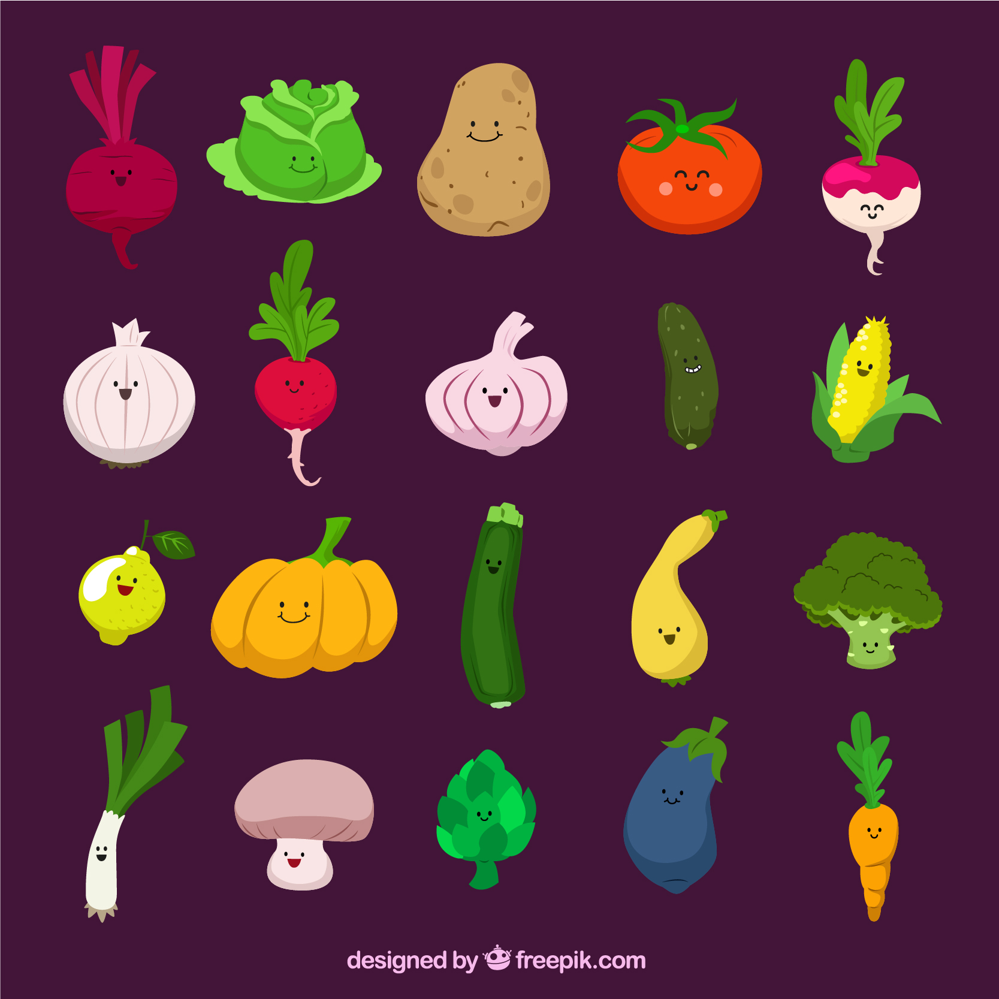

# 🥕 ORTO CONQUISTA

Il gioco di strategia orticola dove l’unico modo per vincere… è concimare tutto il mondo!

## 🎯 OBIETTIVO DEL GIOCO

Conquistare tutti i territori della mappa, eliminando le altre fazioni ortaggio.

Il gioco termina quando un solo giocatore controlla l’intero orto.

---

## 👥 GIOCATORI

- Minimo: 2
- Massimo: 6
- Modalità: Multiplayer online (con lobby e inviti)

---

## 🧅 RUOLO DEI GIOCATORI

Ogni giocatore impersona una **Fazione di Ortaggi**, guidata da un **Ortaggio Leader**.

Ogni fazione ha poteri unici e una personalità.

---

## 🌎 LA MAPPA

La mappa è un orto (o mondo) suddiviso in **30-42 territori**, raggruppati in **6 regioni orticole**.

### 🗺️ Esempio di regioni:

- **Cipollandia** (territori umidi e aromatici)
- **Carotegna** (zone desertiche e scattanti)
- **Maisonia** (pianure fertili)
- **Broccoburgo** (colline verdi)
- **Patatistan** (terre fredde e resistenti)
- **Zuccalopoli** (regione tropicale piena di frutti grossi)

---

## 🧱 COMPONENTI PRINCIPALI

### 1. **Territori**

- Ogni territorio può contenere:
    - 0 o più unità ortaggio
    - Uno specifico tipo di terreno (influenza i bonus)
    - Collegamenti con territori confinanti

### 2. **Unità**

Ogni giocatore ha un esercito orticolo composto da:

| Tipo | Nome | Potere |
| --- | --- | --- |
| 👨‍🌾 Base | Zappatori | Attacco/Difesa standard |
| 💦 Speciale | Spruzzatori | +10% difesa in territori umidi |
| 🔥 Elite | Peperoni Furiosi | +10% attacco ma costano di più |

### 3. **Carte Azione (facoltative)**

- Pescabili a ogni turno in cui si conquista almeno 1 territorio.
- Esempi:
    - “Grandinata!”: elimina 3 unità in un territorio nemico.
    - “Invasione di Parassiti”: blocca produzione in una regione.
    - “Fertilizzante Super”: +5 unità bonus in un tuo territorio.

---

## 🕹️ SVOLGIMENTO DEL GIOCO

Ogni partita si svolge a turni, in ordine rotante.

---

### 🛠️ FASE 0: SETUP

1. I territori vengono assegnati casualmente ai giocatori.
2. Ogni giocatore riceve un numero fisso di unità iniziali da piazzare nei propri territori.
3. Ogni giocatore sceglie il proprio **Ortaggio Leader** (con bonus specifico).

---

### 🔁 TURNI DI GIOCO

Ogni turno è diviso in **3 fasi**:

---

### 1. **Fase di Rifornimento (Produzione)**

- Il giocatore riceve nuove unità in base a:
    - Numero di territori controllati (es. 1 unità ogni 3 territori)
    - Bonus per controllo completo di una regione
    - Carte speciali o bonus leader

🧪 Esempio:

- 18 territori → 6 unità
- Controllo di Carotegna → +3 unità bonus

---

### 2. **Fase di Attacco**

- Il giocatore può attaccare territori adiacenti ai propri.
- Si sceglie:
    - Territorio di partenza
    - Territorio bersaglio
    - Numero di unità da usare (min. 2 per attaccare)

### Meccanica di combattimento:

- Si usano **dadi virtuali** o un **algoritmo a percentuale**.
- Esempio semplificato:
    - Attaccante lancia 3 dadi, difensore 2
    - I dadi più alti si confrontano → chi perde, perde un’unità

🧄 Optional: animazioni comiche di ortaggi che si spruzzano o saltano addosso.

---

### 3. **Fase di Spostamento**

- Il giocatore può **spostare** unità da un territorio a un altro (solo una mossa per turno, o più se leader speciale).
- Serve a rinforzare zone deboli.

---

### 🎉 Fine del Turno

- Se il giocatore ha conquistato almeno un territorio, pesca una **Carta Azione** (se attive).
- Il turno passa al giocatore successivo.

---

## 👑 VITTORIA

### Condizioni di vittoria:

- Un solo giocatore rimasto.
- Oppure: obiettivi segreti (modalità avanzata).

🎯 Esempio di obiettivi segreti:

- Controllare tutte le regioni verdi.
- Eliminare il Cetriolo Blu.
- Ottenere 10 carte azione.

---

## 🧠 ORTAGGI LEADER – ESEMPI

| Ortaggio | Abilità Speciale | Caratteristica |
| --- | --- | --- |
| 🥕 Carota Sprint | +2 unità spostabili per turno | Mobilità |
| 🧄 Aglio Piccante | -1 dado al nemico in difesa | Difesa |
| 🥔 Patata Solida | +1 unità in ogni territorio con 1 sola unità | Resilienza |
| 🥦 Broccolo Verde | +2 unità per ogni regione interamente verde | Territoriale |
| 🌽 Mais Domato | Guadagna 1 carta extra ogni 3 turni | Strategico |

### Prompt

**"Orto Conquista"**

è un gioco strategico multiplayer in stile Risiko, ambientato in un mondo popolato da ortaggi antropomorfi. I giocatori comandano fazioni orticole (come il Clan dei Cavolfiori o la Repubblica delle Cipolle) e si sfidano per il controllo dell'orto globale. Ogni fazione possiede abilità speciali e un ortaggio-leader con poteri unici.

La mappa è suddivisa in regioni coltivabili (es. Cipollandia, Carotegna), ognuna composta da territori adiacenti.

I turni si articolano in tre fasi:

**Produzione**

(guadagni nuove unità),

**Attacco**

(provi a conquistare territori nemici), e

**Spostamento**

(ridistribuisci le unità). Le battaglie si risolvono con logica semplificata stile Risiko.

Il tono del gioco è comico, con battaglie animate, emote vegetali e carte evento assurde (es. “Grandinata”, “Invasione di Limacce”). Vince chi conquista l’intera mappa o completa il proprio obiettivo segreto. Il gioco è progettato per il web, con mappa interattiva SVG e backend multiplayer.

[Roadmap gioco versione lunga](https://www.notion.so/Roadmap-gioco-versione-lunga-24050241389480f8b920eb4485f1dd98?pvs=21)

[Roadmap gioco versione 20 minuti](https://www.notion.so/Roadmap-gioco-versione-20-minuti-24050241389480f68068cd3c04a569c6?pvs=21)